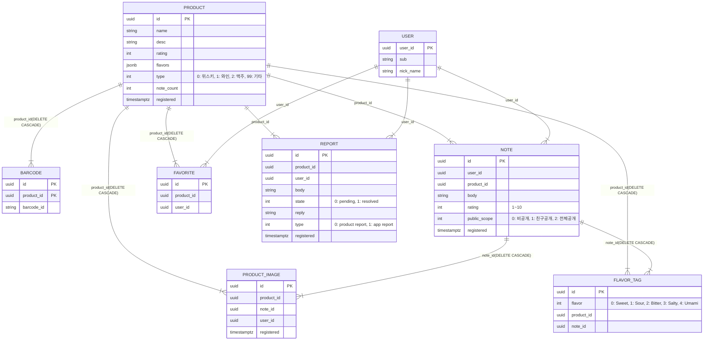

```mermaid
erDiagram
    PRODUCT ||--|{ BARCODE : "product_id(DELETE CASCADE)"
    PRODUCT ||--|{ NOTE : product_id
    PRODUCT ||--|{ FAVORITE : "product_id(DELETE CASCADE)"
    PRODUCT ||--|{ PRODUCT_IMAGE : "product_id(DELETE CASCADE)"
	PRODUCT ||--|{ FLAVOR_TAG : "product_id(DELETE CASCADE)"
	PRODUCT ||--|{ REPORT : product_id
    
    USER ||--|{ FAVORITE : user_id
    USER ||--|{ NOTE : user_id
    USER ||--|{ REPORT : user_id
    
    NOTE ||--|{ PRODUCT_IMAGE : "note_id(DELETE CASCADE)"
    NOTE ||--|{ FLAVOR_TAG : "note_id(DELETE CASCADE)"

    PRODUCT {
        uuid id PK
        string name
		string desc
        int rating 
        jsonb flavors
        int type "0: 위스키, 1: 와인, 2: 맥주, 99: 기타"
        int note_count
        timestamptz registered
    }
    
    BARCODE {
        uuid id PK
        uuid product_id PK
        string barcode_id
    }
    
    NOTE {
        uuid id PK
        uuid user_id
		uuid product_id
        string body
        int rating "1~10"
        int public_scope "0: 비공개, 1: 친구공개, 2: 전체공개"
        timestamptz registered
    }
    
    USER {
		uuid user_id PK
        string sub
		string nick_name
    }

    FAVORITE {
		uuid id PK
		uuid product_id
		uuid user_id
    }
    
    PRODUCT_IMAGE {
		uuid id PK
        uuid product_id
        uuid note_id
        uuid user_id
        timestamptz registered
    }
    
    FLAVOR_TAG {
		uuid id PK
		int flavor "0: Sweet, 1: Sour, 2: Bitter, 3: Salty, 4: Umami"
		uuid product_id
		uuid note_id
    }
    
    REPORT {
		uuid id PK
		uuid product_id
		uuid user_id
		string body
		int state "0: pending, 1: resolved"
		string reply
		int type "0: product report, 1: app report"
		timestamptz registered
    }
```