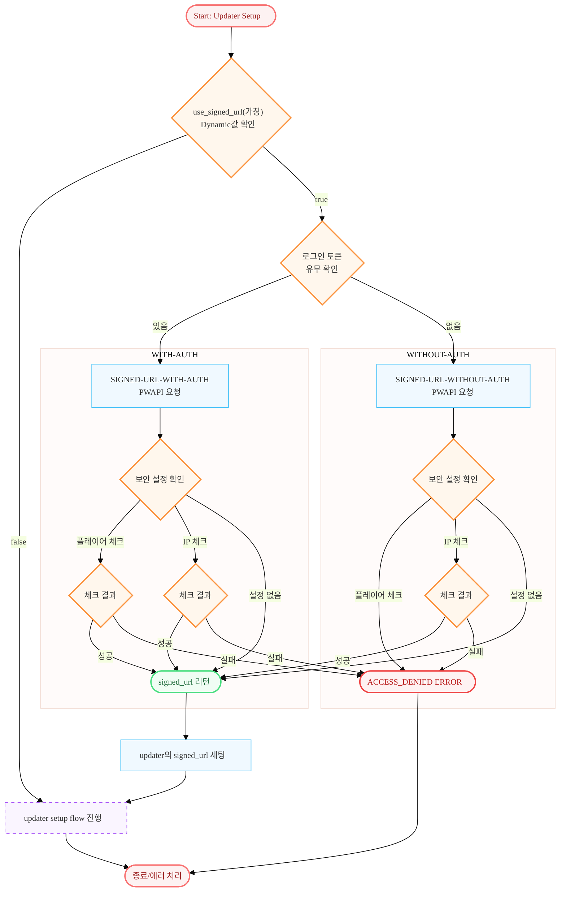

```mermaid
%%{init: {'theme': 'base', 'themeVariables': { 'primaryColor': '#e1f5fe', 'edgeColor': '#546e7a', 'fontSize': '13px', 'fontFamily': 'nanumgothic, sans-serif'}}}%%
graph TD

    %% 스타일 정의
    classDef start fill:#fdf2f2,stroke:#f87171,stroke-width:2px,color:#991b1b;
    classDef decision fill:#fff7ed,stroke:#fb923c,stroke-width:2px;
    classDef process fill:#f0f9ff,stroke:#38bdf8,stroke-width:1px;
    classDef success fill:#f0fdf4,stroke:#4ade80,stroke-width:2px,color:#166534;
    classDef error fill:#fef2f2,stroke:#ef4444,stroke-width:2px,color:#b91c1c;
    classDef flow fill:#faf5ff,stroke:#a855f7,stroke-width:1px,stroke-dasharray: 5 5;

    Start([Start: Updater Setup]):::start --> CheckDynamic{"use_signed_url(가칭)<br/>Dynamic값 확인"}:::decision

    %% 1단계: Dynamic 값 확인
    CheckDynamic -- "false" --> SetupFlow[updater setup flow 진행]:::flow
    CheckDynamic -- "true" --> CheckToken{"로그인 토큰<br/>유무 확인"}:::decision

    %% 2단계: 토큰 유무에 따른 분기
    CheckToken -- "있음" --> ReqAuth[SIGNED-URL-WITH-AUTH<br/>PWAPI 요청]:::process
    CheckToken -- "없음" --> ReqNoAuth[SIGNED-URL-WITHOUT-AUTH<br/>PWAPI 요청]:::process

    %% 3단계: Auth 요청 상세 처리
    subgraph With_Auth_Process [WITH-AUTH]
        direction TB
        ReqAuth --> AuthSecurity{보안 설정 확인}:::decision
        AuthSecurity -- 플레이어 체크 --> AuthPlayerCheck{체크 결과}:::decision
        AuthSecurity -- IP 체크 --> AuthIPCheck{체크 결과}:::decision
        AuthSecurity -- 설정 없음 --> GetSignedURL
    end

    %% 4단계: No Auth 요청 상세 처리
    subgraph Without_Auth_Process [WITHOUT-AUTH]
        direction TB
        ReqNoAuth --> NoAuthSecurity{보안 설정 확인}:::decision
        NoAuthSecurity -- 플레이어 체크 --> ErrorDenied
        NoAuthSecurity -- IP 체크 --> NoAuthIPCheck{체크 결과}:::decision
        NoAuthSecurity -- 설정 없음 --> GetSignedURL
    end

    %% 연결 로직
    AuthPlayerCheck -- 성공 --> GetSignedURL
    AuthPlayerCheck -- 실패 --> ErrorDenied
    AuthIPCheck -- 성공 --> GetSignedURL
    AuthIPCheck -- 실패 --> ErrorDenied
    NoAuthIPCheck -- 성공 --> GetSignedURL
    NoAuthIPCheck -- 실패 --> ErrorDenied

    %% 공통 결과 처리 (Subgraph 바깥)
    GetSignedURL([signed_url 리턴]):::success --> SetURL[updater의 signed_url 세팅]:::process
    ErrorDenied([ACCESS_DENIED ERROR]):::error --> End([종료/에러 처리]):::start

    %% 마무리 단계
    SetURL --> SetupFlow
    SetupFlow --> End
```
