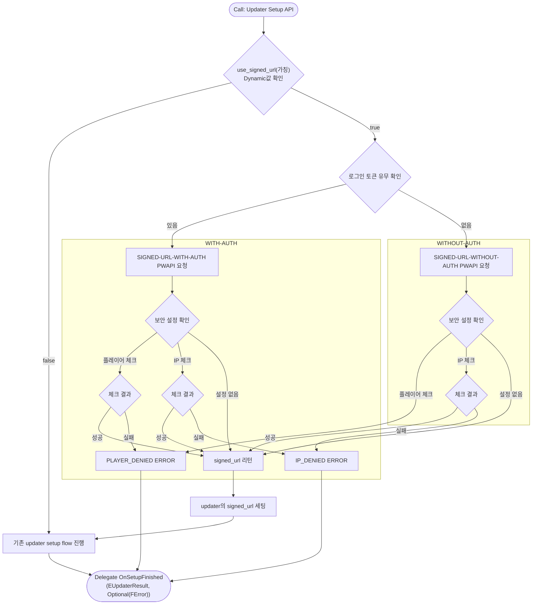

```mermaid
graph TD

Start([Call: Updater Setup API]) --> CheckDynamic{"use_signed_url(가칭)<br/>Dynamic값 확인"}

%% 1단계: Dynamic 값 확인
CheckDynamic -- false --> SetupFlow[기존 updater setup flow 진행]
CheckDynamic -- true --> CheckToken{로그인 토큰 유무 확인}

%% 2단계: 토큰 유무에 따른 분기
CheckToken -- 있음 --> ReqAuth[SIGNED-URL-WITH-AUTH PWAPI 요청]
CheckToken -- 없음 --> ReqNoAuth[SIGNED-URL-WITHOUT-AUTH PWAPI 요청]

%% 3단계: Auth 요청 상세 처리
subgraph With_Auth_Process [WITH-AUTH]
    ReqAuth --> AuthSecurity{보안 설정 확인}
    AuthSecurity -- 플레이어 체크 --> AuthPlayerCheck{체크 결과}
    AuthSecurity -- IP 체크 --> AuthIPCheck{체크 결과}
    AuthSecurity -- 설정 없음 --> GetSignedURL
    
    AuthPlayerCheck -- 성공 --> GetSignedURL
    AuthPlayerCheck -- 실패 --> PlayerError
    
    AuthIPCheck -- 성공 --> GetSignedURL
    AuthIPCheck -- 실패 --> IPError
end

%% 4단계: No Auth 요청 상세 처리
subgraph Without_Auth_Process [WITHOUT-AUTH]
    ReqNoAuth --> NoAuthSecurity{보안 설정 확인}
    NoAuthSecurity -- 플레이어 체크 --> PlayerError
    
    NoAuthSecurity -- IP 체크 --> NoAuthIPCheck{체크 결과}
    NoAuthIPCheck -- 성공 --> GetSignedURL
    NoAuthIPCheck -- 실패 --> IPError
    
    NoAuthSecurity -- 설정 없음 --> GetSignedURL
end

%% 공통 결과 및 에러 처리 (Subgraph 바깥)
GetSignedURL[signed_url 리턴] --> SetURL[updater의 signed_url 세팅]
SetURL --> SetupFlow

%% 에러 노드 세분화
PlayerError[PLAYER_DENIED ERROR] --> End
IPError[IP_DENIED ERROR] --> End

%% 마무리 단계
SetupFlow --> End(["Delegate OnSetupFinished<br/>(EUpdaterResult, Optional(FError))"])
```
